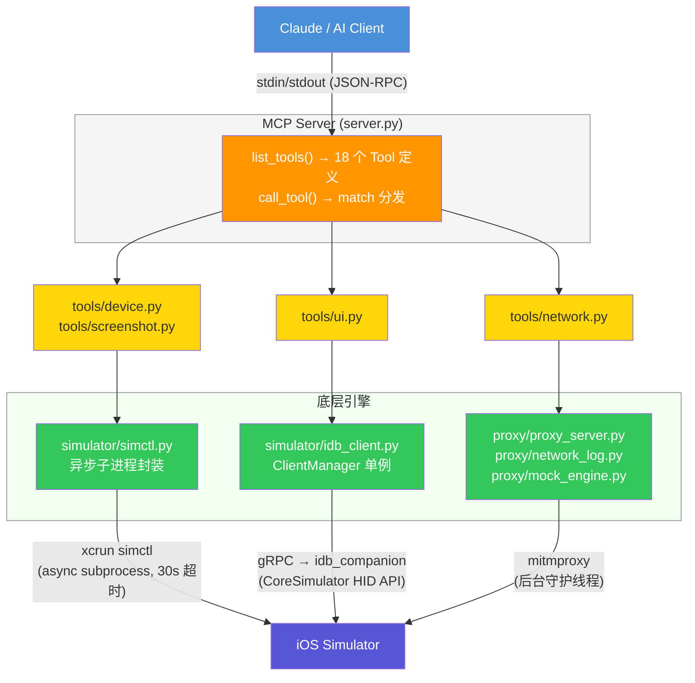
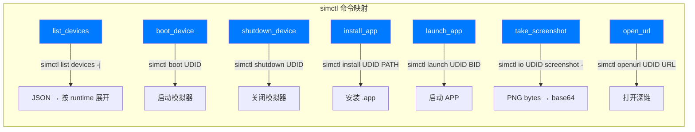
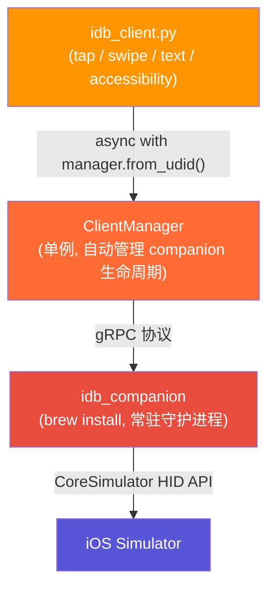
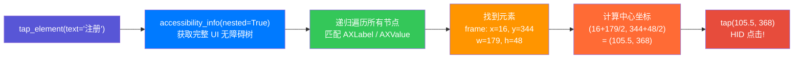
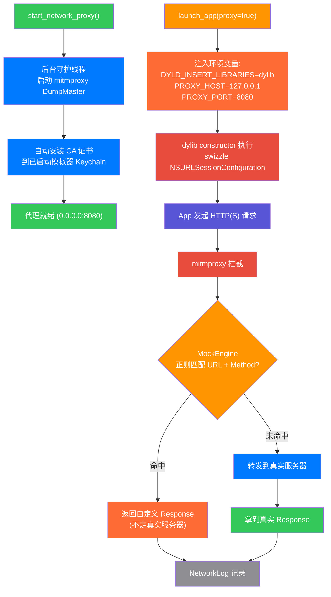
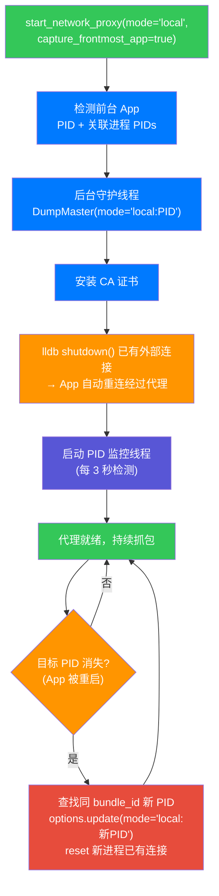
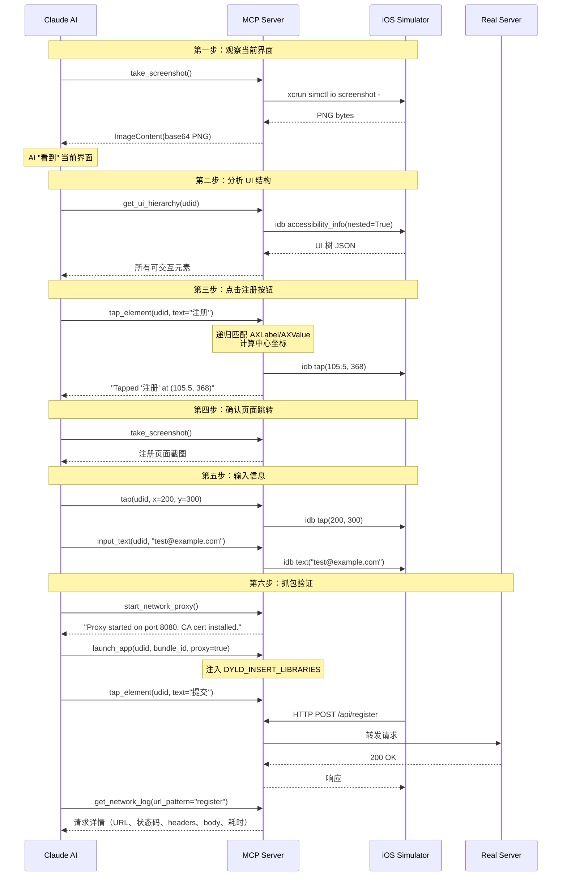
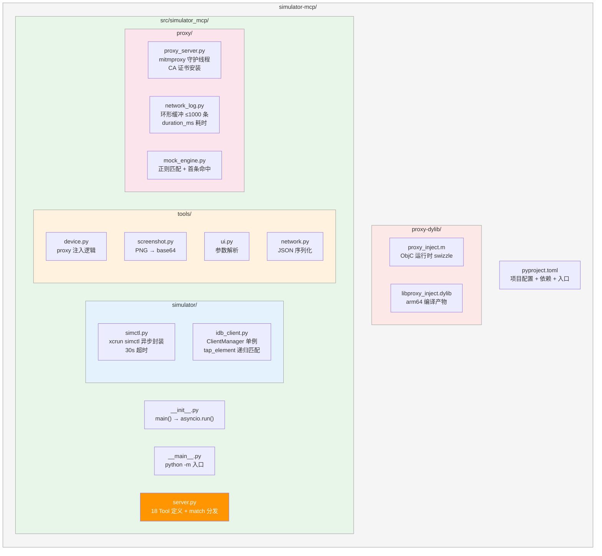

# Simulator MCP 技术架构文档

## 一句话概括

Simulator MCP 是一个通过 MCP 协议暴露 iOS 模拟器操控能力的服务，让 AI（如 Claude）可以像人一样操作模拟器——启动设备、截图、点击按钮、输入文字、抓包、Mock 接口。

## 它解决什么问题

正常情况下，AI 没有能力操作 iOS 模拟器。它只能输出文字，不能点击屏幕、不能查看界面、不能抓网络请求。

这个项目通过 MCP（Model Context Protocol）把模拟器的各种操作封装成"工具"，AI 可以像调用函数一样使用它们：

```
AI 想法: "我要点击注册按钮"
   ↓ 调用 MCP 工具
tap_element(udid="xxx", text="注册")
   ↓ 内部流程: 获取 UI 树 → 递归匹配 → 计算中心坐标 → fb-idb HID tap
   ↓ 返回结果
"Tapped element '注册' at (105.5, 368.0)"
```

## 整体架构



### 分层设计

项目严格三层分离，每层职责清晰：

| 层 | 文件 | 职责 |
|---|------|------|
| **MCP 协议层** | `server.py` | Tool 定义（JSON Schema）、call_tool 分发、错误包装 |
| **工具层** | `tools/*.py` | 参数解析、业务逻辑编排（如 proxy 注入判断） |
| **引擎层** | `simulator/*.py`, `proxy/*.py` | 底层技术封装，与外部系统交互 |

---

## 三大模块详解

### 1. 设备管理 + 截图（基于 xcrun simctl）

`xcrun simctl` 是 Apple 官方的模拟器命令行工具，项目通过异步子进程调用它完成基础操控。

**核心文件**: `simulator/simctl.py`（125 行）

**原理**: 每个操作起一个 `asyncio.create_subprocess_exec`，30 秒超时，截图特殊处理为 15 秒超时。



**关键实现细节**:

- **`run_simctl()`**: 通用异步执行函数，所有 simctl 命令通过它执行，统一 30s 超时和错误处理
- **`launch_app()`**: 环境变量通过 `SIMCTL_CHILD_` 前缀传递（simctl 会自动去掉前缀传给 APP）
- **`take_screenshot()`**: 使用 `screenshot -`（输出到 stdout），避免临时文件，直接拿到 PNG bytes
- **`get_booted_device_udid()`**: 查找 state="Booted" 的设备，`open_url` 和 `take_screenshot` 的 udid 可选时使用

**截图返回 AI 的路径**:
```
simctl io screenshot → PNG bytes → base64 编码 → ImageContent(mimeType="image/png")
                                                  → AI 直接"看到"模拟器屏幕
```

**涉及工具（7 个）**: `list_devices`, `boot_device`, `shutdown_device`, `install_app`, `launch_app`, `open_url`, `take_screenshot`

---

### 2. UI 交互（基于 fb-idb）

fb-idb 是 Facebook 开源的 iOS 模拟器/真机自动化工具，通过 `idb_companion` 守护进程与模拟器的 CoreSimulator HID API 通信。

**核心文件**: `simulator/idb_client.py`（93 行）

**为什么用 fb-idb 而不是模拟鼠标点击？**

之前尝试过 PyObjC 方案（模拟 macOS 鼠标事件），但有两个致命问题：
- 需要把 iOS 坐标换算成 macOS 屏幕坐标，外接显示器时算不准
- 事件投递到模拟器窗口不稳定

fb-idb 走模拟器内部的 HID API，直接用 iOS 原生坐标（points），不经过 macOS 屏幕坐标系。

**连接架构**:



**ClientManager 单例模式**:
```python
_manager: ClientManager | None = None

def _get_manager() -> ClientManager:
    global _manager
    if _manager is None:
        companion_path = shutil.which("idb_companion")  # 自动查找 companion 路径
        _manager = ClientManager(companion_path=companion_path, logger=logger)
    return _manager

# 每次操作通过 async context manager 获取设备连接
async with _get_manager().from_udid(udid=udid) as client:
    await client.tap(x=100, y=200)
```

**tap_element 工作流程**（最智能的工具）:



**元素匹配逻辑** (`_find_element`):
- 递归遍历 UI 树的所有节点
- 匹配条件: `text in AXLabel` 或 `text in AXValue`（子串匹配）
- UI 树可能是单根或多根（list），两种情况都处理
- 未找到时抛出 `ValueError`，告知 AI 元素不存在

**坐标计算** (`_element_center`):
- 兼容两种 frame 格式: `{x, y, width, height}` 和 `{x, y, w, h}`
- 中心点 = `(x + width/2, y + height/2)`

**涉及工具（6 个）**: `tap`, `swipe`, `input_text`, `press_button`, `get_ui_hierarchy`, `tap_element`

---

### 3. 网络抓包 + Mock（基于 mitmproxy + DYLD 注入）

**核心文件**:
- `proxy/proxy_server.py` — mitmproxy 生命周期 + ProxyAddon + local 模式 PID 监控
- `proxy/network_log.py` — 请求日志存储
- `proxy/mock_engine.py` — Mock 规则引擎
- `proxy-dylib/proxy_inject.m` — Objective-C 运行时注入（regular 模式）

**整体流程（regular 模式）**:



**整体流程（local 模式）**:



#### 3.1 ProxyServer 生命周期

```python
class ProxyServer:
    def start(port=8080, mode="regular", capture_frontmost_app=False):
        # 1. regular 模式: DumpMaster(mode=["regular"], listen_port=port)
        #    local 模式: 检测前台 App PID → DumpMaster(mode=["local:PID"])
        # 2. 创建守护线程运行 mitmproxy，等待启动完成
        # 3. 自动安装 CA 证书到 Booted 模拟器
        # 4. local 模式: reset 已有外部连接 + 启动 PID 监控线程
        # 5. 返回启动信息

    def _run_proxy():
        # 独立 asyncio event loop（不能与 MCP server 共用）
        # 注册 ProxyAddon + StartupSignalAddon

    def stop():
        # 停止 PID 监控线程 → master.shutdown() → 线程自动结束

    def get_launch_env():
        # 返回 DYLD_INSERT_LIBRARIES + PROXY_HOST + PROXY_PORT
        # 仅 regular 模式可用

    # --- local 模式专用 ---
    def _reset_existing_connections(pid):
        # lsof 查找非 localhost 的 ESTABLISHED TCP 连接
        # lldb --batch 调用 shutdown(fd, SHUT_RDWR) 断开已有连接
        # App 检测到断开后自动重连，新连接经过代理

    def _monitor_pid():
        # 后台线程，每 3 秒 os.kill(pid, 0) 检查存活
        # PID 消失 → 等 2 秒 → get_frontmost_app 查找同 bundle 新 PID
        # → master.options.update(mode=["local:新PID"]) 动态切换
        # → reset 新进程已有连接
```

**为什么用后台线程？** mitmproxy 需要自己的 asyncio event loop，不能与 MCP server 的 event loop 共用同一线程。守护线程（daemon=True）在主进程退出时自动清理。

**CA 证书自动安装**: 启动代理时自动查找 `~/.mitmproxy/mitmproxy-ca-cert.pem`，通过 `simctl keychain add-root-cert` 安装到已启动的模拟器，确保 HTTPS 拦截不报证书错误。

#### 3.2 ProxyAddon（mitmproxy 钩子）

```python
class ProxyAddon:
    def request(self, flow):
        # 1. 记录请求开始时间（用于计算 duration_ms）
        # 2. MockEngine 匹配 → 命中则直接构造 Response，不转发

    def response(self, flow):
        # 1. 计算请求耗时 (duration_ms)
        # 2. 提取 request/response 信息
        #    - request_body 截取前 1000 字符
        #    - response_body 截取前 2000 字符
        #    - 二进制内容标记为 "<binary>"
        # 3. 写入 NetworkLog
```

#### 3.3 NetworkLog（内存环形缓冲）

```python
@dataclass
class LogEntry:
    id: int                        # 自增 ID
    timestamp: float               # Unix 时间戳
    method: str                    # HTTP 方法
    url: str                       # 完整 URL
    status_code: int | None        # 响应状态码
    request_headers: dict          # 请求头
    response_headers: dict         # 响应头
    request_body: str | None       # 请求体（最多 1000 字符）
    response_body: str | None      # 响应体（存储最多 2000 字符，查询输出截取 500 字符）
    duration_ms: float | None      # 请求耗时（毫秒）
```

- **容量**: 最多 1000 条，超出时丢弃最旧的
- **查询**: 支持 `url_pattern`（URL 子串匹配）+ `method` 筛选，默认返回最新 50 条
- **输出截取**: `to_dict()` 将 response_body 截取到 500 字符，避免返回给 AI 的数据过大

#### 3.4 MockEngine（正则规则引擎）

```python
@dataclass
class MockRule:
    id: str                # "mock_1", "mock_2", ... (自增)
    url_pattern: str       # 正则表达式匹配 URL
    method: str | None     # None 表示匹配所有方法
    status_code: int       # 默认 200
    response_headers: dict # 默认 {"Content-Type": "application/json"}
    response_body: str     # 响应体
```

- **匹配逻辑**: `re.search(url_pattern, request_url)` + 方法大小写不敏感比较
- **优先级**: 遍历所有规则，首条命中即返回
- **规则管理**: add_rule / remove_rule / find_match / list_rules

#### 3.5 DYLD 注入原理（proxy_inject.m）

**目标**: 让模拟器中的 APP 所有 NSURLSession 流量都走代理，无需修改 APP 代码。

**注入机制**:
```
xcrun simctl launch 时设置环境变量:
  SIMCTL_CHILD_DYLD_INSERT_LIBRARIES = /path/to/libproxy_inject.dylib
  SIMCTL_CHILD_PROXY_HOST = 127.0.0.1
  SIMCTL_CHILD_PROXY_PORT = 8080
  ↓
simctl 去掉 SIMCTL_CHILD_ 前缀传给 APP
  ↓
dyld 在 APP 启动时加载 libproxy_inject.dylib
  ↓
__attribute__((constructor)) 在 main() 之前执行
```

**Swizzle 三个目标**:

| 目标 | 方式 | 效果 |
|------|------|------|
| `-connectionProxyDictionary` getter | `method_setImplementation` 替换 | 所有 config 读取代理字典时返回我们的配置 |
| `+defaultSessionConfiguration` | `imp_implementationWithBlock` 包装 | 默认 session 创建后自动设置代理 |
| `+ephemeralSessionConfiguration` | `imp_implementationWithBlock` 包装 | 临时 session 创建后自动设置代理 |

**代理字典内容**:
```objc
@{
    kCFNetworkProxiesHTTPEnable: @YES,
    kCFNetworkProxiesHTTPProxy: @"127.0.0.1",
    kCFNetworkProxiesHTTPPort: @(8080),
    @"HTTPSEnable": @YES,
    @"HTTPSProxy": @"127.0.0.1",
    @"HTTPSPort": @(8080),
}
```

**涉及工具（5 个）**: `start_network_proxy`, `stop_network_proxy`, `get_network_log`, `add_mock_rule`, `remove_mock_rule`

---

## MCP Server 实现（server.py）

### 通信协议

- **传输**: Stdio（stdin/stdout）
- **格式**: JSON-RPC（MCP 协议标准）
- **异步**: 全程 asyncio

### Tool 定义

每个工具通过 `Tool` 对象定义，包含 name、description 和 JSON Schema 的 inputSchema：

```python
Tool(
    name="tap",
    description="Tap at iOS screen coordinates.",
    inputSchema={
        "type": "object",
        "properties": {
            "udid": {"type": "string", "description": "Device UDID"},
            "x": {"type": "number", "description": "X coordinate (iOS points)"},
            "y": {"type": "number", "description": "Y coordinate (iOS points)"},
            "duration": {"type": "number", "description": "Long press duration in seconds (optional)"},
        },
        "required": ["udid", "x", "y"],
    },
)
```

### 请求分发

`call_tool()` 使用 Python match 语句分发到对应的工具函数：

```python
@app.call_tool()
async def call_tool(name: str, arguments: dict):
    try:
        match name:
            case "list_devices":  result = await device.list_devices(arguments)
            case "take_screenshot":
                b64, mime = await screenshot.take_screenshot(arguments)
                return [ImageContent(type="image", data=b64, mimeType=mime)]
            case "tap":           result = await ui.tap(arguments)
            # ... 18 个工具
            case _:               result = f"Unknown tool: {name}"
        return [TextContent(type="text", text=result)]
    except Exception as e:
        return [TextContent(type="text", text=f"Error: {e}")]
```

**截图特殊处理**: 返回 `ImageContent`（base64 PNG），其他工具返回 `TextContent`。

### 错误处理

所有异常在 `call_tool` 顶层捕获，包装为 `TextContent(text="Error: ...")` 返回给 AI，不会导致 MCP 连接中断。

---

## 工具全览（18 个）

| # | 分类 | 工具 | 底层技术 | 必填参数 | 可选参数 |
|---|------|------|----------|----------|----------|
| 1 | 设备 | `list_devices` | simctl | — | — |
| 2 | 设备 | `boot_device` | simctl | udid | — |
| 3 | 设备 | `shutdown_device` | simctl | udid | — |
| 4 | 设备 | `install_app` | simctl | udid, app_path | — |
| 5 | 设备 | `launch_app` | simctl | udid, bundle_id | args, env, proxy |
| 6 | 设备 | `open_url` | simctl | url | udid |
| 7 | 截图 | `take_screenshot` | simctl | — | udid |
| 8 | UI | `tap` | fb-idb | udid, x, y | duration |
| 9 | UI | `swipe` | fb-idb | udid, start_x/y, end_x/y | duration |
| 10 | UI | `input_text` | fb-idb | udid, text | — |
| 11 | UI | `press_button` | fb-idb | udid, button | — |
| 12 | UI | `get_ui_hierarchy` | fb-idb | udid | — |
| 13 | UI | `tap_element` | fb-idb | udid, text | — |
| 14 | 网络 | `start_network_proxy` | mitmproxy | — | port |
| 15 | 网络 | `stop_network_proxy` | mitmproxy | — | — |
| 16 | 网络 | `get_network_log` | mitmproxy | — | url_pattern, method, limit |
| 17 | 网络 | `add_mock_rule` | mitmproxy | url_pattern | method, status_code, response_headers, response_body |
| 18 | 网络 | `remove_mock_rule` | mitmproxy | rule_id | — |

---

## 数据流示例：AI 自动化测试注册流程



整个过程 AI 通过「看截图 → 读 UI 树 → 操作 → 再看截图确认」的循环来完成任务。

---

## 项目文件结构



---

## 依赖项

| 依赖 | 版本要求 | 用途 | 安装方式 |
|------|----------|------|----------|
| mcp | >= 1.0 | MCP 协议 SDK，stdio JSON-RPC 通信 | pip（pyproject.toml） |
| mitmproxy | >= 10.0 | HTTP(S) 代理，实现抓包和 Mock | pip（pyproject.toml） |
| fb-idb | — | iOS 模拟器 UI 自动化（tap/swipe/text/accessibility） | pip（pyproject.toml） |
| idb_companion | — | fb-idb 的 native gRPC 守护进程 | `brew install idb-companion` |
| xcrun simctl | — | Apple 模拟器命令行工具 | 随 Xcode 安装 |
| Python | >= 3.11 | 运行时（match 语句需要 3.10+，类型注解需要 3.11+） | brew / 系统自带 |

---

## 启动方式

```bash
# 方式一：通过 pyproject.toml 定义的入口脚本
simulator-mcp

# 方式二：Python module 方式
python -m simulator_mcp
```

**启动流程**:
```
simulator-mcp (CLI)
  → __init__.py: main()
    → asyncio.run(server.main())
      → stdio_server() 打开 stdin/stdout 流
        → app.run() 开始 MCP JSON-RPC 事件循环
```

启动后通过 stdin/stdout 与 AI 客户端进行 MCP JSON-RPC 通信，日志输出到 stderr。

---

## 关键设计决策

| 决策 | 原因 |
|------|------|
| fb-idb 而非 PyObjC 鼠标模拟 | iOS 原生 HID API，不依赖模拟器窗口位置和 macOS 坐标系 |
| DYLD 注入而非 VPN/全局代理 | 仅影响目标 APP，无需修改代码，swizzle 在 main() 前执行 |
| mitmproxy 独立线程 | mitmproxy 有自己的 asyncio event loop，不能与 MCP server 共用 |
| 内存环形缓冲而非数据库 | 低延迟、零依赖、1000 条约 10-50 MB，足够单次测试 |
| Mock URL 正则而非简单字符串 | 灵活匹配 URL 路径段，如 `api/v[0-9]+/users/.*` |
| response_body 分层截取 | 存储 2000 字符（保留调试信息），输出 500 字符（避免 AI 上下文膨胀） |
